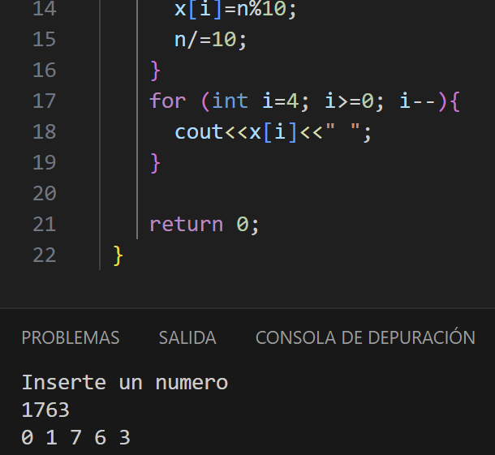
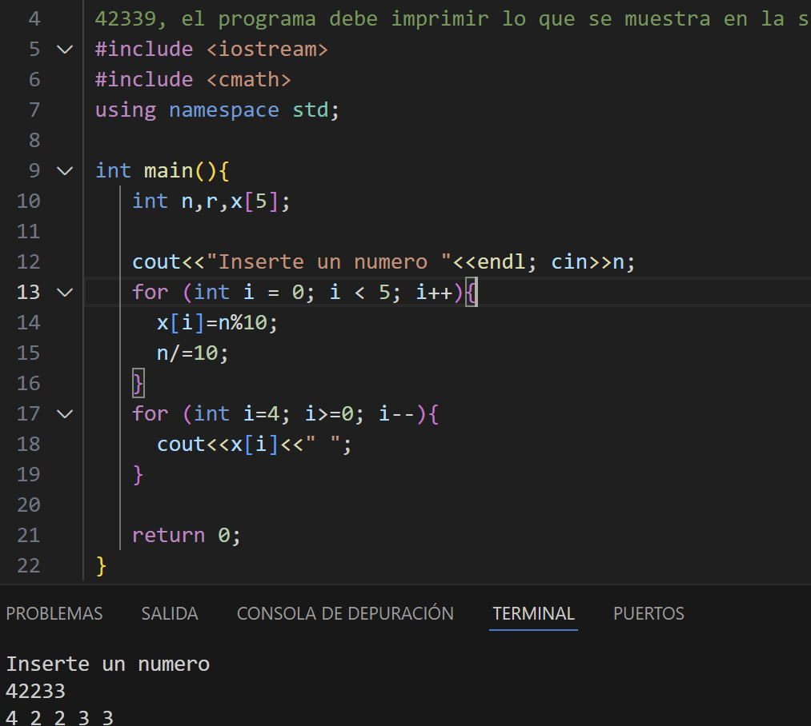
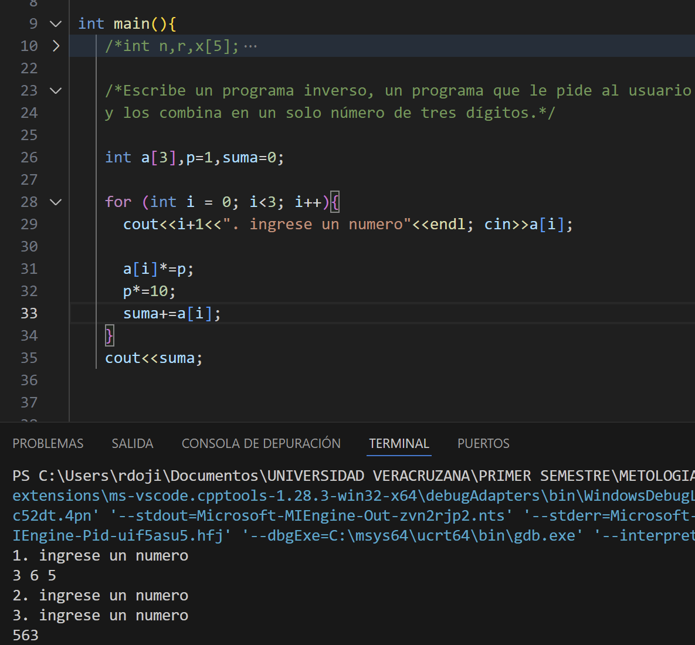

# Ejercicio de laboratorio 3 - Separación de dígitos

## Descripción

Escriba un programa que ingrese un número de cinco dígitos, divida el número en sus dígitos individuales e imprima los dígitos separados entre sí por tres espacios cada uno. [Sugerencia: use la división entera y el operador de módulo.] Por ejemplo, si el usuario ingresa 42339, el programa debe imprimir lo que se muestra en la salida de ejemplo.

```cmd
Introduzca un número entero de cinco dígitos: 42339
Dígitos separados: 4 2 3 3 9
```

## Contesta las siguientes preguntas

1. ¿Cuáles son los resultados de las siguientes expresiones?

   | Operación  |          Resultado         |
   | ---------- | -------------------------- |
   | 24 / 5     |     int=4 ;float=4.8       |
   | 18 % 3     |             0              |
   | 13 % 9     |             4              |
   | 13 / 2 % 2 |             25             |

2. ¿Qué sucede cuando el usuario ingresa un número que tiene menos de cinco dígitos? 
r= se imprime un 0 a los espacios que no tienen valor.
¿Por qué?
r= en mi caso al ocupar arreglos (en mi caso for ocupe "int i=0;i>5;i++" y una vairable x[5] donde se guardarion el resultado de n%10) al momento de meter un numero de 4 digitos, en el espacio 5 como ya solo queda un "0%10", el valor de "x[4]" vale 0 y por eso lo imprime.

¿Cuál es la salida cuando se ingresa 1763? 0 1 7 6 3


3. El programa que completó en este ejercicio de laboratorio ingresa un número con varios dígitos y separa los dígitos. Escribe un programa inverso, un programa que le pide al usuario tres números de un dígito y los combina en un solo número de tres dígitos.

## ✅ Resultado



